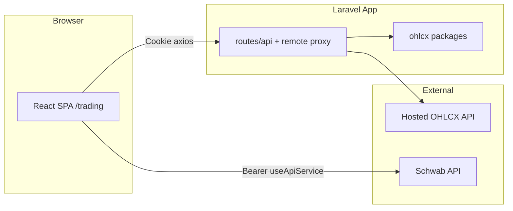

# Contributing

For developers with **private repository access**. Public readers: see [Contributor access](../getting-started/contributor-access.md).

## Architecture at a glance

The app is a **Laravel backend** plus a **React SPA** for a trading platform. Users connect a **Schwab** brokerage account; the app shows dashboard, orders, positions, portfolio, strategies, signals, and advanced order flows.

**Three main pieces:**

- **React SPA** at `/trading` — Mantine UI, Zustand stores, `window.axios` for our API, `useApiService` for the Schwab API.
- **Laravel host** — Routes, auth (Fortify/Jetstream), and proxies. Most domain logic lives in **private `ohlcx/*` Composer packages**.
- **External APIs** — Hosted OHLCX API (Light/proxy) and Schwab (frontend bearer token).



## Development workflow

- **Branching:** `feature/<short-description>`
- **Commits:** `feat:`, `fix:`, `refactor:`, `test:`, `docs:`
- **PRs:** Describe what and why; include test steps; UI screenshots when relevant
- **Verification:**
  - React: `npm run build` or `npm run dev`
  - Laravel: `php artisan test` for affected areas; `vendor/bin/pint` for PHP
  - API: update [api/reference.md](../api/reference.md) and/or [openapi.yaml](../api/openapi.yaml) when routes change
- **Package changes:** Domain logic belongs in the appropriate **`ohlcx/*` package repository**, not in the host `vendor/` tree. Request package repo access from maintainers.

## Frontend conventions

- Entry: `resources/js/app.jsx`
- All app paths under **`/trading`**
- New UI: **Mantine** (Tailwind is legacy)
- State: **Zustand** in `resources/js/store/`
- **Our API:** `window.axios` + Sanctum cookies
- **Schwab:** `useApiService` — see [Data sources](data-sources.md)
- Do not import from `resources/js/legacy/` in production code

## Backend conventions

- API routes in host `routes/api.php`, `routes/remote.php` (Light), and package service providers
- Use `config()` in application code, not `env()` outside config files
- Jobs and domain models live in packages

## Domain concepts

| Concept | Backend | Frontend |
|---------|---------|----------|
| Strategies | API (local or proxied) | useStrategyStore, Strategies pages |
| Signals | `GET /api/signals` | useSignalStore |
| Orders | Schwab via `useApiService` | Order forms |
| Markets / news | API proxy or local packages | Market stores, feeds |

## Public documentation sync

When you change API, MCP, or AI docs in `trading-app`, run the publish sync before releasing public docs:

```bash
cd packages/ohlcx/trading-app
./scripts/sync-public-docs.sh /path/to/ohlcx/docs
```

## Where to look next

| Topic | Document |
|-------|----------|
| Data sources | [data-sources.md](data-sources.md) |
| Packages | [apps-and-packages.md](apps-and-packages.md) |
| API | [reference.md](../api/reference.md) |
| AI / MCP | [overview.md](../ai/overview.md), [MCP overview](../mcp/overview.md) |
| Setup | [Pro setup](../setup/ohlcx-pro.md), [Light setup](../setup/ohlcx-light.md) |
