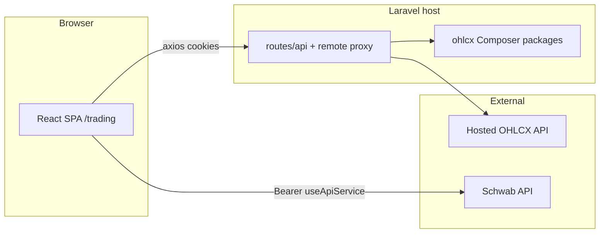

# Architecture overview

## High-level shape

OHLCX is a **Laravel backend** plus a **React SPA** at `/trading`. Users connect a **Schwab** brokerage account. The dashboard covers orders, positions, portfolio, strategies, signals, messaging, and billing.



## Three data paths

1. **Laravel `/api/*`** — Sanctum cookies; auth, profile, strategies (often proxied), chat, credits.
2. **Hosted OHLCX API** — Light edition or proxy routes; bearer token from env (authorized deployments only).
3. **Schwab API** — Frontend `useApiService`; orders, positions, chains, live brokerage data.

## Request flow (typical)

```
React page → /api/... → route closure or package controller
  → OHLCXApiService or package service → DB or external API
```

For MCP/AI domain tools, internal adapters may call the same `/api/*` surface or remote API depending on edition.

## Frontend

- Entry: `resources/js/app.jsx`
- Routes under `/trading` (`BASE_URL`)
- State: Zustand stores; Mantine for UI
- **Our API:** `window.axios` with credentials
- **Broker:** `useApiService` with OAuth bearer token

## Backend

- Thin `app/` layer; domain logic in **Composer packages**
- Pro: local package routes; Light: `routes/remote.php` proxy where packages are absent

## Further reading

- [Apps and packages](apps-and-packages.md)
- [Data sources](data-sources.md)
- [Light vs Pro](light-vs-pro.md)
- [System map](contributing.md#architecture-at-a-glance) (contributing doc includes onboarding architecture section)
