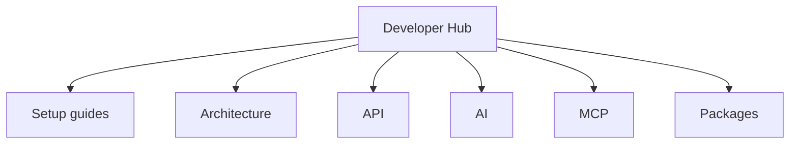

# Overview

## What is OHLCX?

OHLCX is a **trading platform** built with:

- **Backend:** Laravel 12 (Sanctum, Horizon, Reverb, Jetstream)
- **Frontend:** React SPA at `/trading` (Mantine UI, Zustand)
- **Broker:** Schwab (TD Ameritrade API) for accounts, orders, positions, and market data from the browser
- **Domain packages:** Auth, profile, messaging, billing, strategies, markets, news, and analysis (Composer packages under the `ohlcx/*` namespace)

## Editions

### OHLCX Pro (`ohlcx`)

Full product: all domain packages installed locally. Strategies, sectors, price feeds, news, and analysis run in-process or via package routes—no dependency on the hosted OHLCX API for core domain data.

### OHLCX Light (`ohlcx-light`)

Slimmer deployment: trading UI, Schwab integration, credits billing, trading rooms, and user profile. **Sectors** and other domain endpoints are **proxied** to the hosted OHLCX API when local packages are not installed.

## Developer surfaces

| Surface | Audience | Description |
|---------|----------|-------------|
| **REST API** | Integrators, SPA | Cookie-based Sanctum API at `/api/*`; see [API reference](../api/reference.md) |
| **In-app AI** | End users, QA | Drawer assistant with Support / Trading / Assistant modes |
| **MCP** | IDE agents (Cursor, etc.) | 80+ tools via `/mcp/ohlcx` or `php artisan mcp:start ohlcx` |
| **OpenAPI** | Contract consumers | [openapi.yaml](../api/openapi.yaml) |

## Documentation map

## Next steps

1. [Requirements](requirements.md)
2. [Contributor access](contributor-access.md) if you need private repos
3. [OHLCX Pro setup](../setup/ohlcx-pro.md) or [OHLCX Light setup](../setup/ohlcx-light.md)
