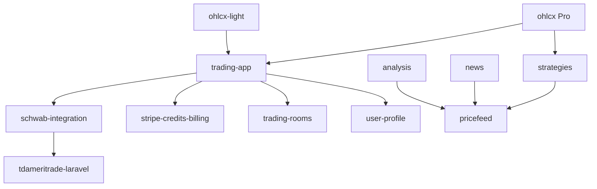

# Package ecosystem

OHLCX is built from **private Composer packages** under the [github.com/ohlcx](https://github.com/ohlcx) organization. This page summarizes responsibilities; source requires authorized access.

## Applications

| Repository | Edition | Packages (high level) |
|------------|---------|------------------------|
| [ohlcx/ohlcx](https://github.com/ohlcx/ohlcx) | **Pro** | Full set below |
| [ohlcx/ohlcx-light](https://github.com/ohlcx/ohlcx-light) | **Light** | trading-app, schwab-integration, tdameritrade-laravel, stripe-credits-billing, trading-rooms, user-profile |

## Core packages

| Package | Doc | Used by |
|---------|-----|---------|
| [trading-app](trading-app.md) | Core UI, API, AI/MCP, KB | Pro, Light |
| [schwab-integration](schwab-integration.md) | Broker tokens, accounts | Pro, Light |
| [tdameritrade-laravel](tdameritrade-laravel.md) | TD/Schwab HTTP client | Via schwab-integration |
| [stripe-credits-billing](stripe-credits-billing.md) | Credits & Stripe | Pro, Light |
| [trading-rooms](trading-rooms.md) | Realtime chat | Pro, Light |
| [user-profile](user-profile.md) | Profile UI/API | Pro, Light |

## Pro-only domain packages

| Package | Doc | Purpose |
|---------|-----|---------|
| [strategies](strategies.md) | ATS / simulation, order routing | Pro |
| [sectors](sectors.md) | Sector taxonomy & charts | Pro |
| [pricefeed](pricefeed.md) | Market price feed layer | Pro |
| [news](news.md) | Market news ingestion | Pro |
| [analysis](analysis.md) | Technical analysis snapshots | Pro |
| development-features | Broadcasting / dev streaming | Pro |
| alpaca-trade-api-php | Alpaca PHP SDK | Pro |
| proxymanager | HTTP proxy pool | Standalone |

Light edition consumes **sectors** and other domain endpoints via the **hosted OHLCX API** instead of local packages.

## Dependency sketch

## Request access

See [Contributor access](../getting-started/contributor-access.md).
