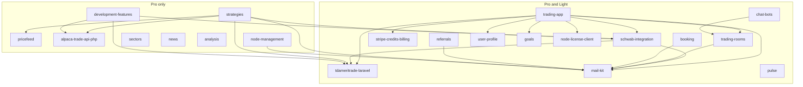

# Package ecosystem

OHLCX is built from **private Composer packages** under the [github.com/ohlcx](https://github.com/ohlcx) organization. This page lists every `ohlcx/*` package the two applications install, what each one is for, and how they depend on each other. Source requires authorized access.

The lists and versions on this page are read from the applications' `composer.json` and `composer.lock`. The dependency diagram is read from each package's own `composer.json`.

## Applications

| Repository | Edition | `ohlcx/*` packages installed |
|------------|---------|------------------------------|
| [ohlcx/ohlcx](https://github.com/ohlcx/ohlcx) | **Pro** | 21: alpaca-trade-api-php, analysis, booking, chat-bots, development-features, goals, mail-kit, news, node-license-client, node-management, pricefeed, pulse, referrals, schwab-integration, sectors, strategies, stripe-credits-billing, tdameritrade-laravel, trading-app, trading-rooms, user-profile |
| [ohlcx/ohlcx-light](https://github.com/ohlcx/ohlcx-light) | **Light** | 13: booking, chat-bots, goals, mail-kit, node-license-client, pulse, referrals, schwab-integration, stripe-credits-billing, tdameritrade-laravel, trading-app, trading-rooms, user-profile |

Pro installs everything Light installs, plus eight packages of its own.

## Packages in both editions

| Package | Responsibility | Version (Pro / Light) | Page |
|---------|----------------|-----------------------|------|
| trading-app | The application layer: trading UI, API routes, relay to the hosted API on Light, knowledge base, in-app assistant, MCP server | 1.0.352 / 1.0.351 | [trading-app](trading-app.md) |
| schwab-integration | Schwab account and token management: linked accounts, balances, profit and loss, cash transfers, order reads | 1.0.49 | [schwab-integration](schwab-integration.md) |
| tdameritrade-laravel | Low-level client for the TD Ameritrade / Schwab API | 1.0.20 | [tdameritrade-laravel](tdameritrade-laravel.md) |
| stripe-credits-billing | Credits bought through Stripe Checkout, and their use | 1.0.34 | [stripe-credits-billing](stripe-credits-billing.md) |
| trading-rooms | Realtime messaging: direct messages, rooms, invites, live sessions | 1.0.49 | [trading-rooms](trading-rooms.md) |
| user-profile | Profile management components and API | 1.012 | [user-profile](user-profile.md) |
| goals | Daily, weekly and monthly realized P&L goal tracking (targets, progress calendar, admin oversight) | 1.0.11 | |
| mail-kit | Shared branded email layout, components and markdown mail theme | 1.0.15 | |
| booking | Self-hosted booking and scheduling (availability rules, public booking widget API, admin management API) | 1.0.18 | |
| referrals | Peer-to-peer invitations and referral program (invite a friend, shareable referral codes, qualification and credit rewards) | 1.0.24 | |
| pulse | Event visibility and Slack alerting for the package ecosystem | 1.0.23 | |
| node-license-client | Node licensing client: a self-hosted deployment registers with a license server and reports to it | 1.0.14 | |
| chat-bots | Simulated chat clients for load-testing and demonstrating trading-rooms' realtime messaging | 1.0.7 | |

## Pro-only packages

| Package | Responsibility | Version | Page |
|---------|----------------|---------|------|
| strategies | Strategies center: conditions, signals, trades, backtests, the screener, and routing a strategy's orders to the owner's linked brokerage accounts | 1.5.0 | [strategies](strategies.md) |
| pricefeed | Market and ticker price data, technical analysis, live price publishing | 1.0.44 | [pricefeed](pricefeed.md) |
| sectors | Sector definitions, sector tickers, sector balance snapshots and charts | 1.0.12 | [sectors](sectors.md) |
| news | Featured news and articles | 1.0.15 | [news](news.md) |
| analysis | Scheduled ticker analysis snapshots | 1.0.14 | [analysis](analysis.md) |
| alpaca-trade-api-php | PHP SDK for the Alpaca trade API | 1.0.15 | |
| development-features | Development features: broadcasting lifecycle, channels and data streaming API | 1.0.2 | |
| node-management | Node licensing and management server (node registration, heartbeat, admin approve, reject and revoke API) | 1.0.13 | |

OHLCX Light does not install these. It reaches strategies, markets, sectors, news and analysis through the **hosted OHLCX API**, relayed by trading-app. See [Light vs Pro](../architecture/light-vs-pro.md).

## Not installed by either application

Two packages of the organization are not required by Pro or Light and are not part of this section: **proxymanager** (an HTTP proxy manager, listed here in earlier editions) and **support** (a client support and ticketing platform).

## Dependencies

Each arrow is a `require` in the package's own `composer.json`. An arrow points from a package to the package it requires.

```mermaid
flowchart TB
  subgraph both[Pro and Light]
    ta[trading-app]
    schwab[schwab-integration]
    td[tdameritrade-laravel]
    billing[stripe-credits-billing]
    rooms[trading-rooms]
    profile[user-profile]
    goals
    mail[mail-kit]
    license[node-license-client]
    booking
    referrals
    bots[chat-bots]
    pulse
  end
  subgraph proonly[Pro only]
    strategies
    pricefeed
    alpaca[alpaca-trade-api-php]
    dev[development-features]
    nodes[node-management]
    sectors
    news
    analysis
  end
  ta --> license
  ta --> td
  ta --> schwab
  ta --> billing
  ta --> profile
  ta --> rooms
  ta --> goals
  ta --> mail
  schwab --> td
  schwab --> mail
  rooms --> mail
  booking --> mail
  referrals --> mail
  bots --> rooms
  strategies --> alpaca
  strategies --> td
  strategies --> schwab
  strategies --> pricefeed
  strategies --> mail
  dev --> alpaca
  dev --> td
  dev --> schwab
  nodes --> mail
```

Packages without an arrow require no other `ohlcx/*` package. Some name others as optional (`suggest`) and work with them when the application installs them:

| Package | Suggests |
|---------|----------|
| trading-app | booking, referrals, pulse |
| pricefeed | alpaca-trade-api-php, strategies |
| news | alpaca-trade-api-php, pricefeed |
| analysis | pricefeed, strategies |
| sectors | pricefeed |

## Request access

See [Contributor access](../getting-started/contributor-access.md).
